# Surfnet transaction lifecycle

One transaction's states between submission and finality, decided by a
single machine. The vocabulary is the real node's: a client watching a
signature sees nothing, then processed, confirmed, finalized. The
machine adds the state a node holds internally (admitted: accepted, not
yet executed) and the two terminal outcomes a client infers rather than
observes (rejected before the ledger, expired in the queue).

An execution error is payload on `Processed`, never a state: a failed
execution still lands on the ledger, and commitment progression changes
what the network promises about an execution, never the execution
itself.

```mermaid
stateDiagram-v2
    [*] --> Unknown
    Unknown : Unknown<br/>arrived, no admission decision yet
    Admitted : Admitted<br/>accepted, queued for execution
    Rejected : Rejected<br/>refused before the ledger; reported to the submitter
    Processed : Processed<br/>on the ledger; an execution error is payload
    Confirmed : Confirmed<br/>included in a confirmed block
    Finalized : Finalized<br/>past the finalization threshold
    Expired : Expired<br/>aged out in the queue; the signature never resolves
    Unknown --> Admitted : Admit
    Unknown --> Rejected : Reject
    Admitted --> Rejected : Reject
    Admitted --> Processed : Execute
    Admitted --> Expired : Expire
    Processed --> Confirmed : Confirm
    Confirmed --> Finalized : Finalize
    Rejected --> [*]
    Finalized --> [*]
    Expired --> [*]
```

<!-- BEGIN GENERATED: diagram -->
<!-- BEGIN MERMAID: transaction-lifecycle -->

<!-- END MERMAID: transaction-lifecycle -->
<!-- END GENERATED: diagram -->

## Transitions

One row per accepting edge. The edge policy column names the knobs that
gate the edge; "unconditional" means the edge fires whenever its source
state holds. What varies between a real node and a test engine is when
and whether an edge fires, never the state set, so every configuration
difference lives in this column and the states stay fixed.

<!-- BEGIN GENERATED: transitions -->
| State                                             | Transition                                  | New state                                         | Edge policy                                                                                                                                          |
|---------------------------------------------------|---------------------------------------------|---------------------------------------------------|------------------------------------------------------------------------------------------------------------------------------------------------------|
| [Unknown][TransactionLifecycleState::Unknown]     | [Admit][TransactionTransition::Admit]       | [Admitted][TransactionLifecycleState::Admitted]   | sigverify unless skip_sig_verify; recency unless skip_blockhash_check; simulation unless skip_preflight; a durable nonce selects ValidateAtExecution |
| [Unknown][TransactionLifecycleState::Unknown]     | [Reject][TransactionTransition::Reject]     | [Rejected][TransactionLifecycleState::Rejected]   | the failing side of the admission checks                                                                                                             |
| [Admitted][TransactionLifecycleState::Admitted]   | [Reject][TransactionTransition::Reject]     | [Rejected][TransactionLifecycleState::Rejected]   | a pre-execution engine failure: account fetch, ALT resolution                                                                                        |
| [Admitted][TransactionLifecycleState::Admitted]   | [Execute][TransactionTransition::Execute]   | [Processed][TransactionLifecycleState::Processed] | an execution error is payload, not state; a failed execution still lands                                                                             |
| [Admitted][TransactionLifecycleState::Admitted]   | [Expire][TransactionTransition::Expire]     | [Expired][TransactionLifecycleState::Expired]     | ValidateAtExecution only; recency validated at admission cannot expire                                                                               |
| [Processed][TransactionLifecycleState::Processed] | [Confirm][TransactionTransition::Confirm]   | [Confirmed][TransactionLifecycleState::Confirmed] | slot cadence: the next block after execution                                                                                                         |
| [Confirmed][TransactionLifecycleState::Confirmed] | [Finalize][TransactionTransition::Finalize] | [Finalized][TransactionLifecycleState::Finalized] | slot at least the confirmation slot plus FINALIZATION_SLOT_THRESHOLD                                                                                 |
<!-- END GENERATED: transitions -->

Properties:

- Any transition not listed above is refused, leaving the state
  untouched; the spec's table lists each refusal decided rather than
  defaulted, and its totality test is what makes this line complete.
- Admission and execution each happen at most once; a repeated
  execution of a stored signature is refused rather than overwriting
  the entry.
- Expiry exists only between admission and execution: before admission
  there is nothing to expire, and an execution that lands has outrun
  the window.
- `Rejected`, `Finalized`, and `Expired` are terminal. `Rejected` is
  reported to the submitter and to no one else; `Expired` is reported
  to no one, and the client discovers it when the blockhash's
  `lastValidBlockHeight` passes. An expired or rejected signature may
  be resubmitted; a processed one may not.

## Enforcement

The machine decides legality; `surfpool-core` owns the durable state
and passes every write through two gates.

- `SurfnetSvm::commit_processed_transaction` is the execution gate:
  it stores the registry entry, queues it for confirmation, and
  notifies signature and logs subscribers, refusing a second execution.
  The error and logs the notifications carry are read from the stored
  entry itself, so the projection cannot disagree with it.
- `SurfnetSvm::advance_transaction_commitment` is the commitment gate:
  the confirmation and finalization drains advance the registry entry
  before any notification fires, so durable state leads projection.

The registry entry's variant is the stored image of the lifecycle
state (`Received` for admitted, then `Processed`, `Confirmed`,
`Finalized`), and a missing entry is `Unknown`. Gates rehydrate the
machine from that image, so resuming at a persisted state is
continuation of prior gated transitions, never a bypass.

N.B. The wire projection reads the stored lifecycle: a transaction's
commitment level on the wire is the registry entry's state, and the
drains are what advance it, never the clock. A remote transaction has
no local lifecycle, so the remote lookup path keeps slot arithmetic;
the confirmations count stays arithmetic everywhere, because it is a
count rather than the status.

<!-- BEGIN GENERATED: links -->
[TransactionLifecycleState::Admitted]: TransactionLifecycleState::Admitted
[TransactionLifecycleState::Confirmed]: TransactionLifecycleState::Confirmed
[TransactionLifecycleState::Expired]: TransactionLifecycleState::Expired
[TransactionLifecycleState::Finalized]: TransactionLifecycleState::Finalized
[TransactionLifecycleState::Processed]: TransactionLifecycleState::Processed
[TransactionLifecycleState::Rejected]: TransactionLifecycleState::Rejected
[TransactionLifecycleState::Unknown]: TransactionLifecycleState::Unknown
[TransactionTransition::Admit]: TransactionTransition::Admit
[TransactionTransition::Confirm]: TransactionTransition::Confirm
[TransactionTransition::Execute]: TransactionTransition::Execute
[TransactionTransition::Expire]: TransactionTransition::Expire
[TransactionTransition::Finalize]: TransactionTransition::Finalize
[TransactionTransition::Reject]: TransactionTransition::Reject
<!-- END GENERATED: links -->
